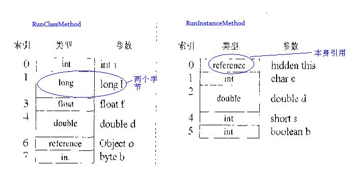

java 虚拟机（JVM）在运行Java程序时，将其管理的内存分割成不同的区域，这些不同的区域又有不同的用途。


## JVM栈

栈是由栈帧组成的，当调用一个方法时，可以从类型信息中获得局部变量区和操作数栈的大小，并以此分配栈内存，然后JVM就会在对应的线程中压入一个帧。栈帧的组成：局部变量区、操作数栈、帧数据区，如图：


- 局部变量区

  局部变量区可以看作一个以一个字长为单位的数组，局部变量表存放了编译器可知的各种基本数据类型(`boolean`、`byte`、`char`、`short`、`int`、`float`、`long`、`double`)、对象引用(引用指针，并非对象本身)，其中64位长度的long和double类型的数据会占用2个局部变量的空间，其余数据类型只占1个。在访问局部变量中的long或者double时，只需获取第一个位置的索引。

  ```java
  public static int runClassMethod(int i,long l,float f,double d,Object o,byte b) { 
     return 0;   
  }
  
  public int runInstanceMethod(char c,double d,short s,boolean b) { 
         return 0;   
  }
  ```

  

  

  

- 操作数栈

  操作数栈和局部变量区一样，也被组织成一个以字长为单位的数组。两者不同的是，操作数栈不是通过索引访问的，而是通过入栈和出栈来访问。可以将操作数栈理解为一个**临时的存储区域**。

  ```java
  	int a = 100;
  	int b = 98;
  	int c = a+b;
  ```

  

- 帧数据区

  栈帧还需要一些数据来支持常量池解析、正常方法返回以及异常派发机制。这些数据都保存在java栈帧的帧数据区中。

  当JVM执行到需要常量池数据的指令时，它都会通过帧数据区中指向常量池的指针来访问它。

   除了处理常量池解析外，帧里的数据还要处理java方法的正常结束和异常终止。如果是通过return正常结束，则当前栈帧从Java栈中弹出，恢复发起调用的方法的栈帧。如果方法又返回值，JVM会把返回值压入到发起调用方法的操作数栈。

## 堆

堆，又叫Java堆，是被各个线程共享的内存区域，也是JVM所管理的最大的一块区域，我们通常所说的JVM优化主要就是针对堆的优化。该内存区域主要用来存放对象实例和数组。分配的最小值和最大值默认为操作系统物理内存的**1/64和1/4**，但小于1G。可以通过**-Xms**和**-Xmx**设定其大小。默认当空余堆内存小于40%时，JVM会增大Heap到`-Xmx`指定的大小，可通过**-XX:MinHeapFreeRation=**来设置这个比例当空余堆内存大于70%时，JVM会减小heap的大小到-Xms指定的大小，可通**XX:MaxHeapFreeRation=**来指定这个比列。

> 为避免在运行时频繁调整Heap的大小，通常-Xms与-Xmx的值设成一样。

堆被划分为新生代和老年代，新生代主要存新创建的对象和尚未进入老年代的对象；老年代存储经过多次GC仍然存活的对象。

- 新生代：新生代有**Eden Space**和两块相同大小的**Survivor Space**（通常又称S0和S1或From和To）组成。可通过**-Xmn**调整新生代的大小，也可通过**-XX:SurvivorRation**来调整Eden Space和Survivor Space的大小。
- 老年代：用于存放经过多次新生代GC任然存活的对象。新创建的对象也有可能直接进入老年代，有两种情况：
  - 大对象，可以通过-XX:PretenureSizeThreshold=1024(单位为字节)参数指定超过多大就直接在老年代分配存储。
  - 大的数组对象，切数组中无引用外部对象。

## 方法区

又称“持久代”、“非堆”，该区域也是被各个线程共享的内存区域，默认最小值和最大值分别为16M和64M，可通过**-XX:PermSize**和**-XX:MaxPermSize**设定方法区的大小。用于存储虚拟机加载的对象的类型信息。类型信息指定义在java代码中的常量、静态变量、定义的方法和方法字段等等。

#### 运行时常量池

运行时常量池是方法区的一部分，所以也是共享的。**其作用是存储 Java 类文件常量池中的符号信息。**

> **class 文件中存在常量池(非运行时常量池)，其在编译阶段就已经确定；运行时常量池相对于 class 常量池一大特征就是其具有动态性，Java 规范并不要求常量只能在运行时才产生，也就是说运行时常量池中的内容并不全部来自 class 常量池，class 常量池并非运行时常量池的唯一数据输入口；在运行时可以通过代码生成常量并将其放入运行时常量池中。**

#### HotSpot 方法区变迁

- JDK1.2 ~ JDK6：在 JDK1.2 ~ JDK6 的实现中，HotSpot 使用永久代实现方法区；

- JDK7：**JDK7中符号表被移动到 Native Heap中，字符串常量和类引用被移动到 Java Heap中。**
- JDK8：**在 JDK8 中，永久代已完全被元空间(Meatspace)所取代。**

## 本地方法栈

与JVM栈类似，本地方法栈为Native方法提供服务。

## 程序计数器

> 是最小的一块内存区域，它的作用是当前线程所执行的字节码的行号指示器，在虚拟机的模型里，字节码解释器工作时就是通过改变这个计数器的值来选取下一条需要执行的字节码指令，分支、循环、异常处理、线程恢复等基础功能都需要依赖计数器完成。