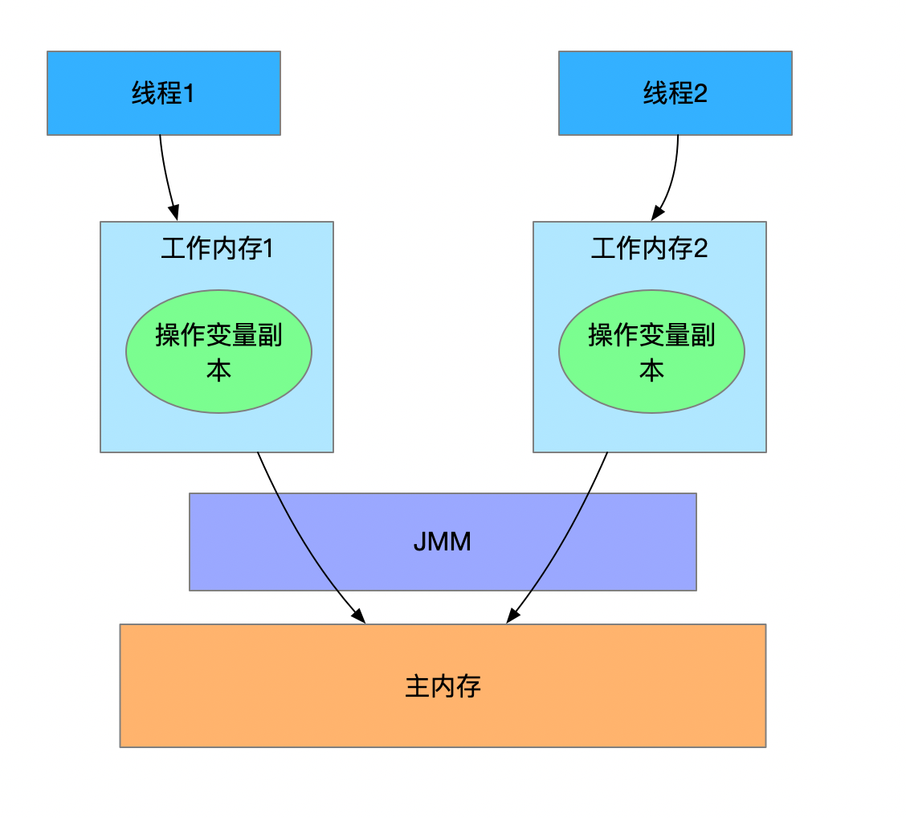

# Java内存模型

### 为什么要有内存模型

我们先类比系统的内存模型，在多核系统中，一般都有多级缓存，L1、L2甚至还有L3，缓存的作用是加速数据的访问速度来提高CPU的性能。但是这也给我们带来很多挑战，比如：两个CPU同时访问同一个内存地址会发生什么？

> 缓存一致性问题

### 什么是内存模型

内存模型就定义一个规范，让**当前的处理器可以看到其他处理器写入的数据**，或者反过来也是一样，让其他处理器能够看到当前处理器写入内存的数据。

### 什么是Java 内存模型

Java 内存模型（Java Memory Model），简称JMM，它是一个语言层面的内存模型，和多线程有关的**抽象概念**，它定义了一组规范，该规范定义了**一个线程对共享变量的写入时对另一个线程是可见的**。也就是我们常说的，Java线程之间通过共享内存实现通信。

### Java 内存模型有什么作用

“一个线程的写操作对其他线程可见”这个问题是因为编译器对代码进行重排序导致的，比如JVM的即时编译器(JIT)也会做指令重排。JMM通过禁止特定类型的编译器重排序和处理器重排序，来保证一直都内存可见性。

> 如果两个线程同时操作同一个共享变量，（如果没有JMM）就会出现数据的一致性问题。

为了保证并发编程下的数据安全性，需要满足三个特性：

- 原子性：即cpu在执行一个操作时不能被中断，要不执行完，要不就不执行；
- 可见性：多线程访问同一个变量时，一个线程对变量的修改时，其他线程能够立即看到修改后的值。
- 有序性：就说程序按照我们期望的顺序执行。

JMM就是解决这个问题的，谈到多线程、并发编程我们自然联想到如final、synchronized、volatile、concurren包等关键字，JMM定义的语法集映射到Java中就是这些关键字。

### 重排序

在程序运行时，编译器和处理器会以提升性能的名义对指令做重排序。

程序代码从编译到运行时指令会经过以下重排序：

1. 编译器优化的重排序。编译器在**不改变单线程程序语义**的前提下，可以重新安排语句的执行顺序。
2. 指令级并行的重排序。现代处理器采用了指令级并行技术（Instruction-Level Parallelism， ILP）来将多条指令重叠执行。如果不存在数据依赖性，处理器可以改变语句对应机器指令的执行顺序。
3. 内存系统的重排序。由于处理器使用缓存和读 / 写缓冲区，这使得加载和存储操作看上去可能是在乱序执行。

JMM通过禁止**特定类型**的编译器重排序和处理器重排序(**注意：不是全部**)，来保证一直都内存可见性。

### 处理器重排序

| Processor A                             | Processor B                             |
| --------------------------------------- | --------------------------------------- |
| a = 1; // 步骤：A1 x = b; //步骤：A2 | b = 2; //步骤：B1 y = a; //步骤：B2 |

>初始状态：a = b = 0
>
>处理器允许执行后得到结果：x = y = 0

假设处理器A和处理器B按照顺序并行执行，就有可能出现x=y=0，原因分析如下图：

从内存操作实际发生的顺序来看，直到处理器 A 执行 A3 来刷新自己的写缓存区，写操作 A1 才算真正执行了。虽然处理器 A 执行内存操作的顺序为：A1->A2，但内存操作实际发生的顺序却是：A2->A1。此时，处理器 A 的内存操作顺序被重排序了。（处理器B也是一样）

### 内存屏障指令

为了保证内存可见性，java编译器在生成指令序列的适当位置会插入**内存屏障**指令来禁止某种特定类型的处理器重排序。

屏障类型：

| 屏障类型            | 示例                               | 说明                                                         |
| ------------------- | ---------------------------------- | ------------------------------------------------------------ |
| LoadLoad Barriers   | Load1;  LoadLoad;  Load2     | 确保 Load1 数据的装载，之前于 Load2 及所有后续装载指令的装载。 |
| StoreStore Barriers | Store1;  StoreStore;  Store2 | 确保 Store1 数据对其他处理器可见（刷新到内存），之前于 Store2 及所有后续存储指令的存储。 |
| LoadStore Barriers  | Load1;  LoadStore;  Store2   | 确保 Load1 数据装载，之前于 Store2 及所有后续的存储指令刷新到内存。 |
| StoreLoad Barriers  | Store1;  StoreLoad;  Load2   | 确保 Store1 数据对其他处理器变得可见（指刷新到内存），之前于 Load2 及所有后续装载指令的装载。StoreLoad Barriers 会使该屏障之前的所有内存访问指令（存储和装载指令）完成之后，才执行该屏障之后的内存访问指令。 |

> StoreLoad Barriers 是一个“全能型”的屏障，它同时具有其他三个屏障的效果。现代的多处理器大都支持该屏障（其他类型的屏障不一定被所有处理器支持）。执行该屏障开销会很昂贵，因为当前处理器通常要把写缓冲区中的数据全部刷新到内存中（buffer fully flush）。

### happens-before

JDK5开始，java使用最新的JSR-133内存模型。JSR-133提出happens-before的概念，通过这个概念来阐述操作之间内存可见性。

Happens-before规则如下：

- 程序顺序规则：一个线程中的每个操作，happens- before 于该线程中的任意后续操作。
- 监视器锁规则：对一个监视器锁的解锁，happens- before 于随后对这个监视器锁的加锁。
- volatile 变量规则：对一个 volatile 域的写，happens- before 于任意后续对这个 volatile 域的读。
- 传递性：如果 A happens- before B，且 B happens- before C，那么 A happens- before C。