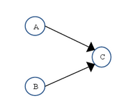
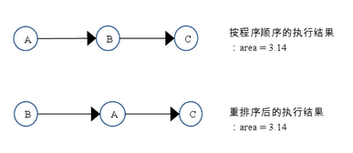

# Java内存模型-重排序

我们知道了，程序执行时编译器和处理器会对指令进行重排序以提升性能。重排序时，会遵守数据依赖性，也就是说，重排序不会改变存在数据依赖性的两个操作的执行顺序。

### 数据依赖性

如果两个操作访问同一个变量，其中一个操作为写操作，那么就说这两个操作之间存在数据依赖性。数据依赖性有三种情况：

| 类型   | 代码示例     | 说明                           |
| ------ | ------------ | ------------------------------ |
| 写后读 | a = 1;b = a; | 写入变量a后，再读取变量a       |
| 写后写 | a = 1;a = 2; | 写入变量a后，再写同一个变量    |
| 读后写 | a = b;b = 1; | 读取一个变量后，再写入这个变量 |

> PS:这里所说的数据依赖性是针对单个处理器执行的指令和单线程中执行的操作。编译器和处理器不会考虑不同处理器和多线程的数据依赖性

### as-if-serial语义

as-if-serial 语义的意思指：不管怎么重排序，都**不能改变程序在单线程环境中的执行结果。**

看以下代码示例：

```java
double pi  = 3.14;    //A
double r   = 1.0;     //B
double area = pi * r * r; //C
```

这段代码的依赖关系如图：



可以看出A和C存在数据依赖关系，B和C也存在数据依赖关系，所以C操作不能排在A和B之前。该程序只能有以下两种执行顺序：



### 重排序对多线程的影响

分析一段代码

```java
class ReorderExample {
  int a = 0;
  boolean flag = false;

  public void writer() {
      a = 1;                   //操作1
      flag = true;             //操作2
  }

	public void reader() {
    if (flag) {                //操作3
        int i =  a * a;        //操作4
    }
	}
}
```

假设有两个线程 A 和 B，A 首先执行 writer() 方法，随后 B 线程接着执行 reader() 方法。线程 B 在执行操作 4 时，能否看到线程 A 在操作 1 对共享变量 a 的写入？

答案：**不一定**

原因如下：

操作1和操作2没有依赖关系，操作3和操作4也没有依赖关系，所以编译器和处理器可以对他们进行重排序。

- 操作1 和 操作2 做重排序

  

  如果按照这样的操作顺序，就读了错误的值，没能读到a的写入。

- 操作3 和操作4 做重排序


操作3和操作4的重排序破坏了多线程的语义。

问题：读操作在if判断里面，为什么会在进入if(flag)之前执行呢？

> 在程序中，操作 3 和操作 4 存在控制依赖关系。当代码中存在控制依赖性时，会影响指令序列执行的并行度。为此，编译器和处理器会采用猜测（Speculation）执行来克服控制相关性对并行度的影响。以处理器的猜测执行为例，执行线程 B 的处理器可以提前读取并计算 a*a，然后把计算结果临时保存到一个名为重排序缓冲（reorder buffer ROB）的硬件缓存中。当接下来操作 3 的条件判断为真时，就把该计算结果写入变量 i 中。

